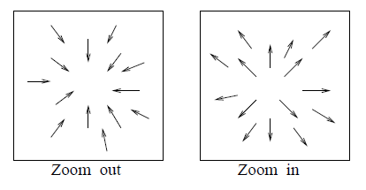
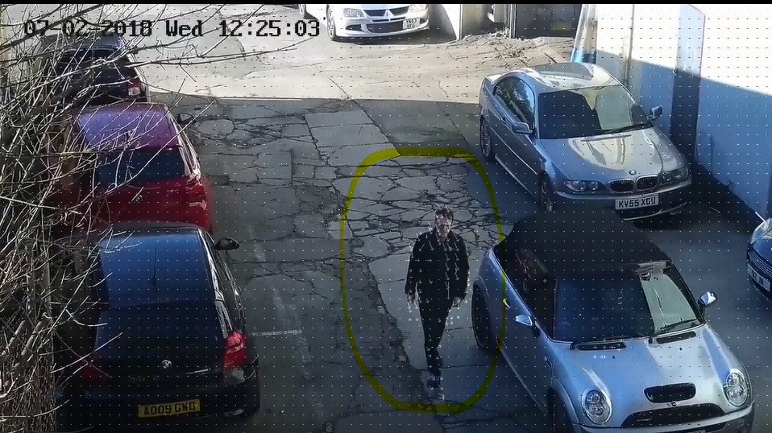
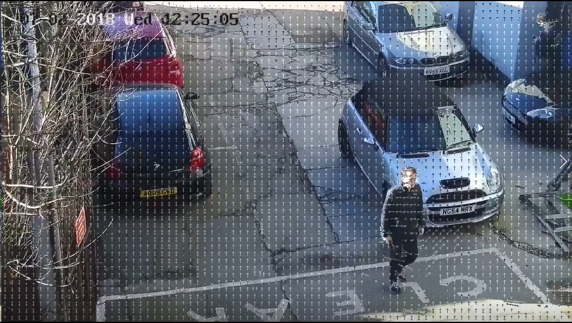

<!-- START doctoc generated TOC please keep comment here to allow auto update -->
<!-- DON'T EDIT THIS SECTION, INSTEAD RE-RUN doctoc TO UPDATE -->
**Table of Contents**  *generated with [DocToc](https://github.com/thlorenz/doctoc)*

- [**Camera Motion Detection**](#camera-motion-detection)
  - [0. Overview](#0-overview)
  - [1. Visualisation](#1-visualisation)
  - [2. Implementation](#2-implementation)
  - [3. Extracting from video stream](#3-extracting-from-video-stream)
  - [4. Usage](#4-usage)
  - [5. Libraries](#5-libraries)

<!-- END doctoc generated TOC please keep comment here to allow auto update -->

# **Camera Motion Detection**

## 0. Overview

Source: Computer Vision by Shapiro & Stockman

A moving camera creates image change due to its own motion, even if the 3D environ ment is unchanging. This motion has several uses. First, it may create more observations of the environment than available from a single viewpoint - this is the case when a panning camera is used to provide a wider (panoramic) view of the scene. Secondly, it can provide for computation of relative depth of objects since the images of close objects change faster than the images of remote objects. Third, it can provide for perception/measurement of the 3D shape of nearby objects - the multiple viewpoints allow for a triangulating computation similar to binocular stereo. In processing or analyzing video or film content, it is often important to detect points in time when the camera is panned or zoomed: in this case, we
may not be interested in the contents of the scene but rather in the manner in which the scene was viewed.

Motion of 3D scene points results in motion of the image points to which they project. There are 2 possible cases:

1. Zoom ( In / Out)
Zooming out can be performed by reducing the focal length of a still camera or by backing away from the scene while keeping the focal length xed. The optical axis points toward a scene point whose image does not move: this is the focus of contraction. Zooming in is performed by increasing the focal length of a still camera or by moving toward a particular scene point whose image does not change (focus of expansion).



2. Pan (Right to Left / Left to Right)
Panning a camera or turning our heads causes the images of the 3D scene points to translate,


## 1. Visualisation

Test video from: https://www.youtube.com/watch?v=DU_QgDd37UM

Below is a screen shot of motion vectors visualized when there is a moving object, but no camera movement. The motion vectors are localized to the moving object (man highlighted in yellow)



Now with camera moving, the motion vectors are throughout the frame, in a consistent direction, indicating camera movement.



Below you can see a short video clip which has object movement & camera movement, with "motion vectors" visualized.

[](https://www.youtube.com/watch?v=ItrvOtqtOQM)

## 2. Implementation

OpenCV provides all these in a single function, cv.calcOpticalFlowPyrLK(). Here, we create a simple application which tracks some points in a video. To decide the points, we use cv.goodFeaturesToTrack(). We take the first frame, detect some Shi-Tomasi corner points in it, then we iteratively track those points using Lucas-Kanade optical flow. For the function cv.calcOpticalFlowPyrLK() we pass the previous frame, previous points and next frame. It returns next points along with some status numbers which has a value of 1 if next point is found, else zero. We iteratively pass tracking points from cv.goodFeaturesToTrack() in next step.

As we extact the motion vectors, we store the motion vector orientation in a list. We check for the magnitude of each of the vectors to be greater than the "displacement pixels".

```
if ((b-d)**2 + (a-c)**2)**0.5 > args['displacement']:
    mv.append(math.atan2(b-d,a-c)) 
```
Next we create an histogram of these motion vector orientation, with bins for every 45 degrees, and if any bin contains more than the threshold percentage of pixels, we conclude that the camera is panning.

```
if len(mv) > 5: # at least 5 motion vectors
    mv = np.array(mv) # convert to numpy array
    mv[mv < 0] = mv[mv < 0] + 2*math.pi # convert to 0 - 360
    mv = np.degrees(mv) # convert to degress
    # create histogram with bins every 45 degrees
    bin_size = 60
    hist,bins = np.histogram(mv, bins=list(range(0-bin_size//2,361-bin_size//2,bin_size)))
    hist = hist/sum(hist) # normalize the histogram
    if sum(hist > args['threshold']): # compare against the threshold. if true, we have panning!
        # frame = cv.circle(frame,(20,20),10,(0,0,255),-1)
        frame = cv.rectangle(frame, (10,10), (frame.shape[1]-10, frame.shape[0]-10), color=(0,0,255), thickness=10)
        print("camera panned {}".format(list(range(0-bin_size//2,361-bin_size//2,bin_size))[np.argmax(hist)]))

```

## 3. Extracting from video stream

The above code is a proof of concept. In real life conditions, motion vectors are generated as part of the video compression step, and in most cases can be extracted from the input stream, thus it should not incur additional computation overhead. 

## 4. Usage

A red circle on top left corner of image indicates panning.

Input parameters are:
- "-u", "--url", type=str, default="", help="Youtube URL"
- "-v", "--video", type=str, default="input.mp4", help="path to input video file"
- "-d", "--displacement", type=int, default=3, help="displacement in pixels between 2 frames"
- "-t", "--threshold", type=float, default=0.5, help="threshold for percentage of motion vectors in a given direction"

Apart from these inputs, the following parameters need to be tweaked based on input image size:

- Parameters for ShiTomasi corner detection

  `feature_params = dict(maxCorners = 100, qualityLevel = 0.3, minDistance = 5, blockSize = 5)`

- Parameters for lucas kanade optical flow

  `lk_params = dict(winSize = (9,9), maxLevel = 2, criteria = (cv.TERM_CRITERIA_EPS | cv.TERM_CRITERIA_COUNT, 10, 0.03))`

Sample runs:

`$ py .\camera_movement_detection.py -u "https://www.youtube.com/watch?v=iEptXPEbyE0"`

`$ py .\camera_movement_detection.py -u "https://www.youtube.com/watch?v=DU_QgDd37UM"`


## 5. Libraries

You need to install the following:

For all image processing
- numpy
- opencv

In case you want to use video's directly from youtube
- pafy
- youtube_dl